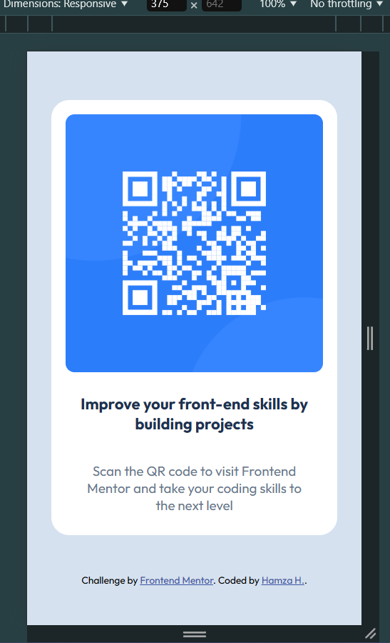
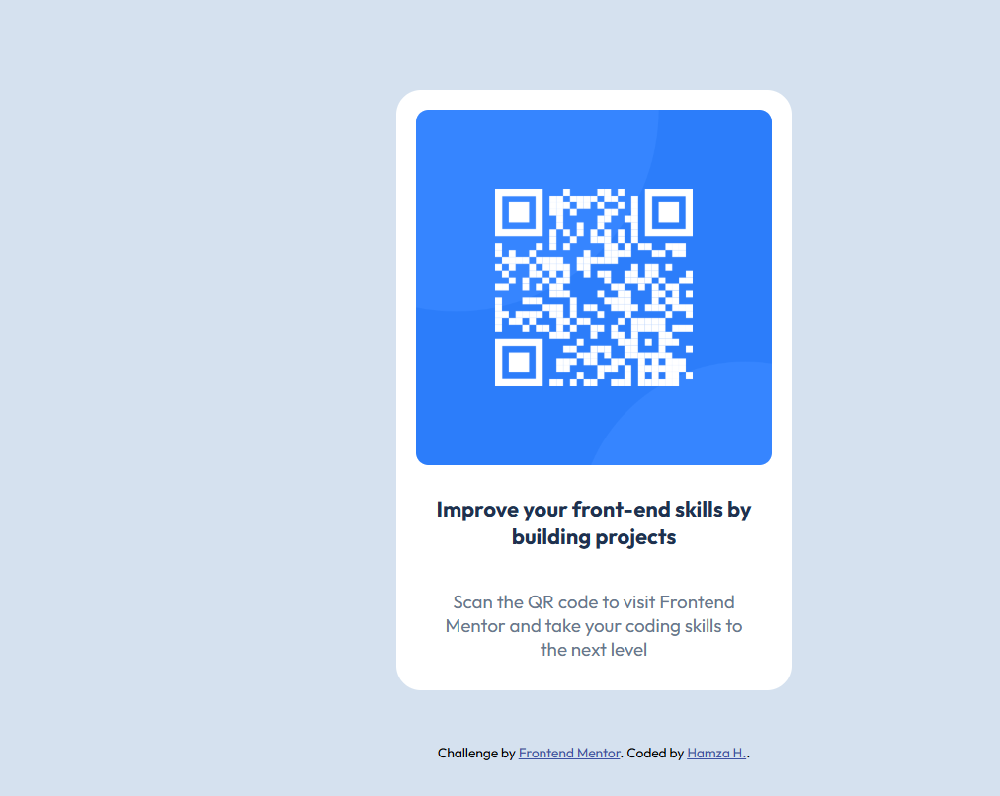

# Frontend Mentor - QR Code Component Solution

This is a solution to the [QR Code Component challenge on Frontend Mentor](https://www.frontendmentor.io/challenges/qr-code-component-iux_sIO_H). Frontend Mentor challenges help you improve your coding skills by building realistic projects.

## Table of Contents

- [Overview](#overview)
  - [Screenshot](#screenshot)
  - [Links](#links)
- [Built With](#built-with)
- [What I Learned](#what-i-learned)
- [Useful Resources](#useful-resources)
- [Author](#author)

## Overview

### Screenshot




### Links

- [Solution URL](https://github.com/hhamza1/qr-code-component)
- [Live Site URL](https://hhamza1.github.io/fm-qr-code-component/)

## Built With

- Semantic HTML5 markup
- CSS custom properties
- Flexbox
- Mobile-first workflow
- [Google Fonts - Outfit](https://fonts.google.com/specimen/Outfit)

## What I Learned

This project helped me practice structuring a simple but effective component using semantic HTML and modern CSS. I improved my understanding of Flexbox and mobile-first design.

Here are some snippets I'm proud of:

```css
.qrcode-container {
    display: flex;
    flex-direction: column;
    justify-content: center;
    text-align: center;
    background-color: #fff;
    border-radius: 20px;
    margin: 27px;
}
```

```html
<div class="qrcode-container">
  <div class="img-container">
    
  </div>
  <div class="text-container">
    <h3>Improve your front-end skills by building projects</h3>
    <p>Scan the QR code to visit Frontend Mentor and take your coding skills to the next level</p>
  </div>
</div>
```

## Useful Resources

- [CSS Tricks - A Complete Guide to Flexbox](https://css-tricks.com/snippets/css/a-guide-to-flexbox/) - This article helped reinforce my knowledge of Flexbox.
- [MDN Web Docs - Responsive Design](https://developer.mozilla.org/en-US/docs/Learn/CSS/CSS_layout/Responsive_Design) - Great resource for understanding mobile-first approaches.

## Author

- GitHub - [hhamza1](https://github.com/hhamza1)
- Frontend Mentor - [@hhamza1](https://www.frontendmentor.io/profile/hhamza1)